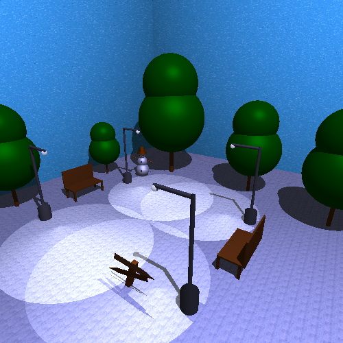
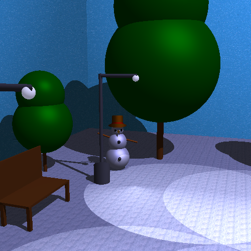
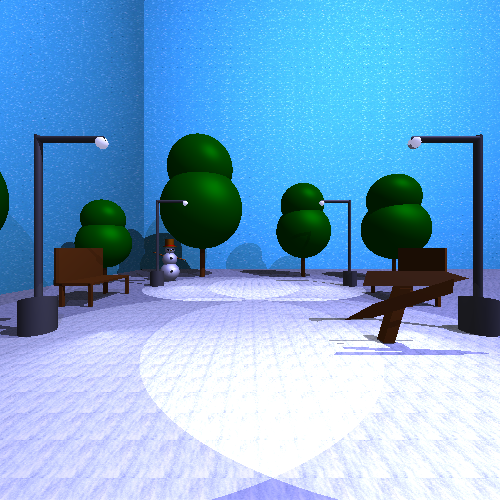
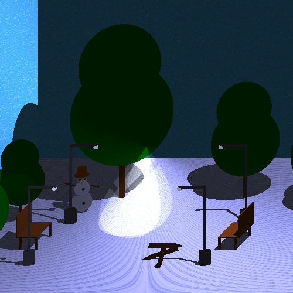
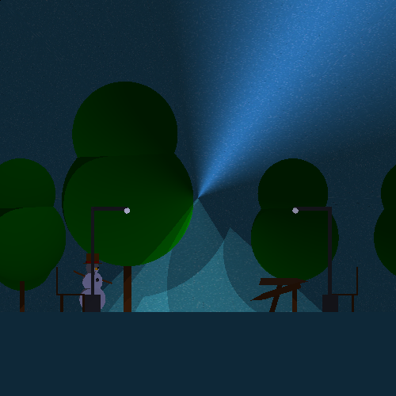

# Computação Gráfica I — 2025.2
---
Repositório referente à disciplina **Computação Gráfica I (2025.2)**, ministrada pelo **Professor Creto Vidal**.


### API Gráfica Desenvolvida por
- **Américo Vitor Moreira Barbosa**
- **Aluízio Almendra Pereira Neto**


> Universidade Federal do Ceará (UFC) 
> Departamento de Computação


## Requisitos
---
- Sistema Operacional: Linux
- CMake
```Bash
sudo apt install cmake
```
- FreeGlut
```Bash
sudo apt install freeglut3-dev
```


## Como rodar?
---
Passo a passo de como rodar a interface gráfica com o cenário modelado:


1. Clone o repositório no seu ambiente local
2. Dentro do repositório, no terminal, execute o seguinte comando para compilação:
```Bash
chmod +x build.sh
```
3. Após compilar, execute no terminal para rodar a interface:
```Bash
./build.sh
```


## Construção do cenário
---
Dentro de TRABALHO FINAL📂, em OBJETOS📂 existe o construtor para todos os objetos utilizados
no cenário. No arquivo ```main.cpp```, existe todo o script de construção do cenário, como o posicionamento dos objetos, especificações da câmera e projeção da tela. Logo qualquer mudança de câmera ou posicionamento devem ser feitas dentro deste arquivo.


## Fotografias
---
### 3 Pontos de fuga



---


### SnowMan





---


### 1 Ponto de fuga



---


### Projecao Obliqua (Cabinet)



---


### Projecao Ortografica (Frontal)



